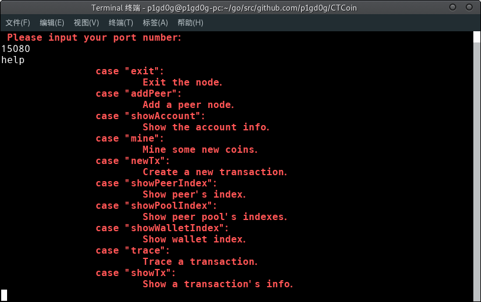

# CTCoin - Conditional Traceable Coin

A blockchain node building on [pbc](https://github.com/Nik-U/pbc),
designed to obtain a conditional traceable cryptocurrency transaction protocol,
which is mainly based on a new linkable ring signature scheme.

It emplements some base operations like `new transaction`, `new wallet`, `mine`,
etc and can be deployed in LAN communicating with `Json` data.

## Start

**Warning:** [pbc](https://github.com/Nik-U/pbc) is a pairing-friendly curve
which supports all types of pairing, thus do not put into production unless
you are an experienced cryptographer.

## Build

Build [PBC library](https://crypto.stanford.edu/pbc/) then
`go get -u github.com/Nik-U/pbc`.

### License

MIT.
